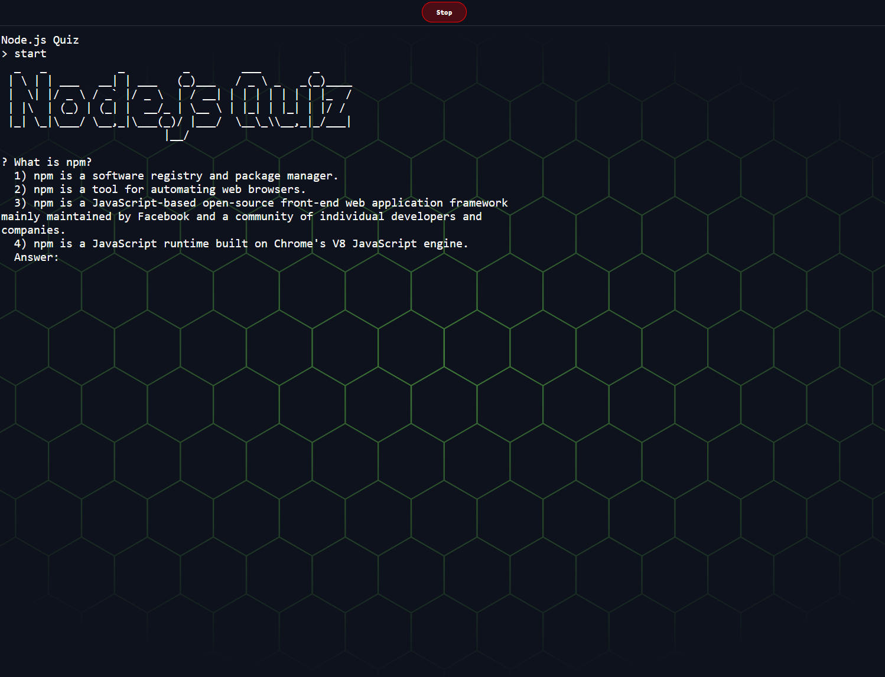

# Node.js Quiz

## Table of Contents

- [Overview](#overview)
- [Technologies Used](#technologies-used)
- [Screenshots](#screenshots)

_This program was originally a homework assignment at LaunchCode's Lc101 (2019) originally named Candidate Testing which was a Node.js based trivia quiz. Since then, the quiz was updated to test users on Node.js itself (among other things)._

## Overview

A webpage that allows the user to run a command line application for a Node.js quiz. The quiz runs in a command line environment via `child_process` module on a remote Express.js server. Once the command line application is started, its IO is synchronized with this webpage via WebSocket.

## Technologies Used

- JavaScript
- HTML
- CSS
- Inquirer
- Figlet
- Express
- ws (WebSocket)

## Screenshots

