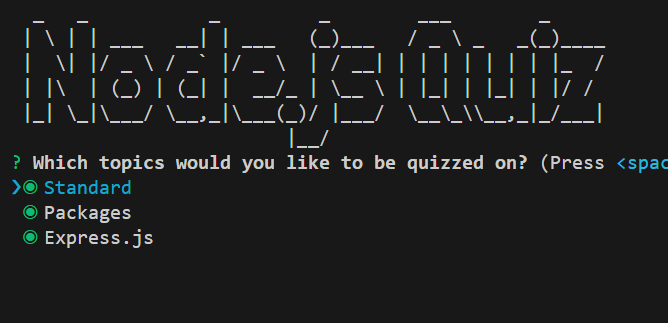

# Candidate Testing

A trivia quiz written in node.js for the purpose of demonstrating and exercising competency in fundamental programming concepts such as functions, for loops, arrays, indexing, string formatting, and more. 

The quiz program uses the .txt files "questions.txt" and "answers.txt" to store the questions and correct answers. Each item (i.e. each question and each correct answer) is recorded on its own line in their respective .txt file. The program assumes that an answer recorded on line #7 in "answers.txt" corresponds to line #7 in "questions.txt". With that in mind, it is relatively easy to update the quiz as to incoporate different questions and answers.

Screenshots of the quiz can be found below.

*This program was a homework assignment at LaunchCode's Lc101 (2019)*

# Enter Candidtate Name

# Answer Questions (Failing attempt)

# Results (Failing Attempt)

# Results (Passing Attempt)

